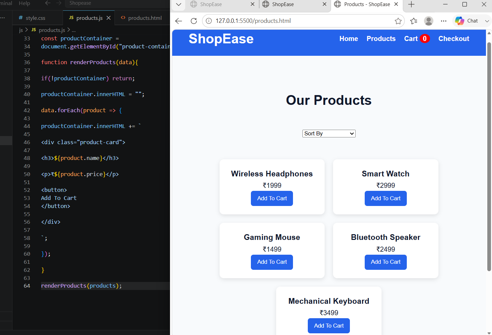
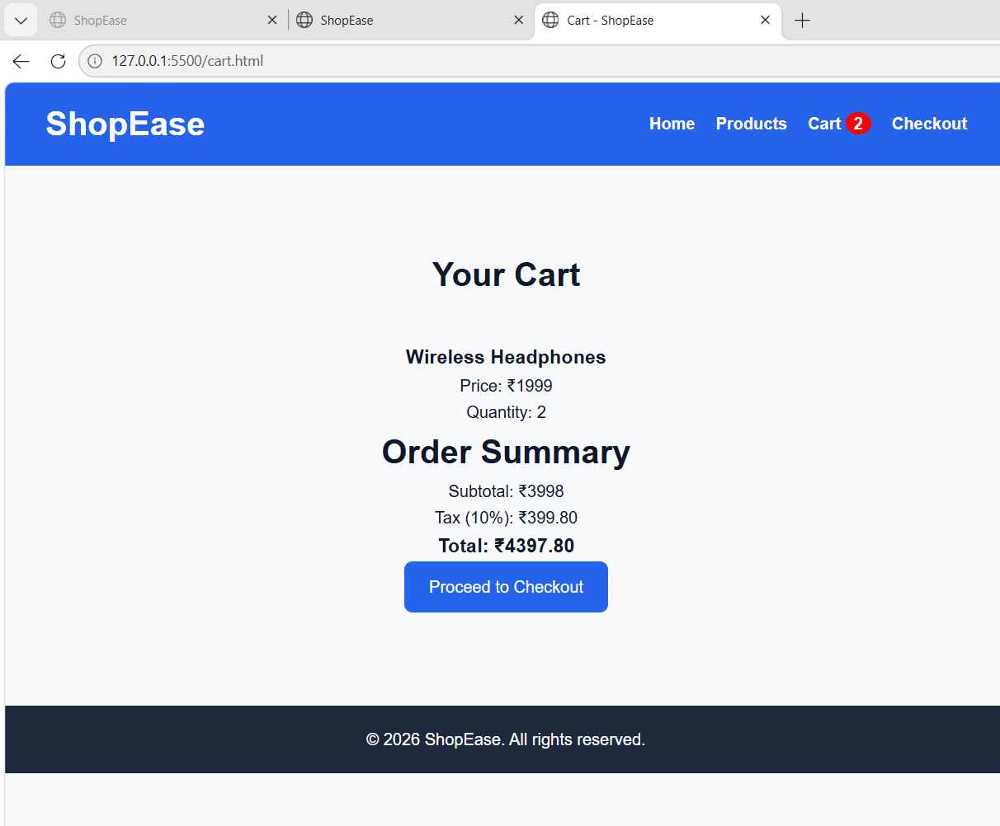
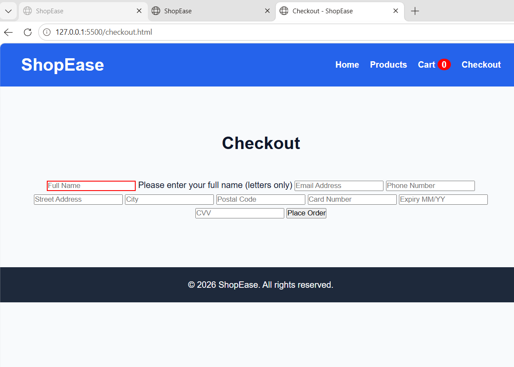
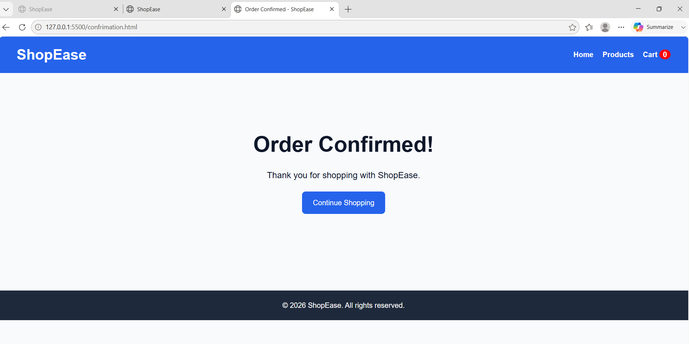

# 🛒 ShopEase – E-Commerce Website

A responsive e-commerce website built using HTML, CSS, and JavaScript. The project simulates a complete online shopping experience, including product browsing, shopping cart management, checkout validation, and order confirmation.

---

## 📌 Features

### 🏠 Home Page
- Modern responsive design
- Featured products section
- Promotional offers section
- Easy navigation

### 🛍️ Product Catalogue
- Dynamic product rendering using JavaScript
- Product cards with pricing information
- Product sorting functionality
- Add-to-cart feature

### 🛒 Shopping Cart
- Real-time cart counter updates
- LocalStorage-based cart persistence
- Quantity management
- Cart total calculation

### 💳 Checkout System
- Customer information form
- Payment details form
- Client-side validation
- Order placement workflow

### ✅ Order Confirmation
- Successful order confirmation page
- Cart reset after purchase
- Continue shopping functionality

---

## 🛠️ Technologies Used

- HTML5
- CSS3
- JavaScript (ES6)
- LocalStorage API

---

## 📂 Project Structure

```text
ShopEase
│
├── index.html
├── products.html
├── product-detail.html
├── cart.html
├── checkout.html
├── order-success.html
│
├── css
│   ├── style.css
│   ├── responsive.css
│   └── animations.css
│
├── js
│   ├── main.js
│   ├── products.js
│   ├── cart.js
│   ├── cartlogic.js
│   └── validation.js
│
└── images
```

---

## 🚀 How to Run

1. Clone the repository:

```bash
git clone https://github.com/bhavyaKomati/shopease-ecommerce-website.git
```

2. Open the project folder in VS Code.

3. Install the Live Server extension.

4. Right-click on:

```text
index.html
```

5. Select:

```text
Open with Live Server
```

---

## 🔄 User Flow

```text
Home Page
     ↓
Products Page
     ↓
Add Products to Cart
     ↓
Cart Page
     ↓
Checkout Form
     ↓
Validation
     ↓
Order Success Page
```
### Products Page



### Cart Page



### Checkout Page



### Order Confirmation Page


---

## 🎯 Learning Outcomes

- DOM Manipulation
- Event Handling
- Form Validation
- LocalStorage Management
- Responsive Web Design
- JavaScript Functions & Objects
- Frontend Project Structure
- E-Commerce Workflow Implementation

---

## 👩‍💻 Author

**Komati Bhavya Sree**

- B.Tech (CSE)
- Krishna University

---

## ⭐ Future Enhancements

- Product Search
- Product Filtering
- User Authentication
- Wishlist Functionality
- Payment Gateway Integration
- Backend Database Support
- Admin Dashboard
